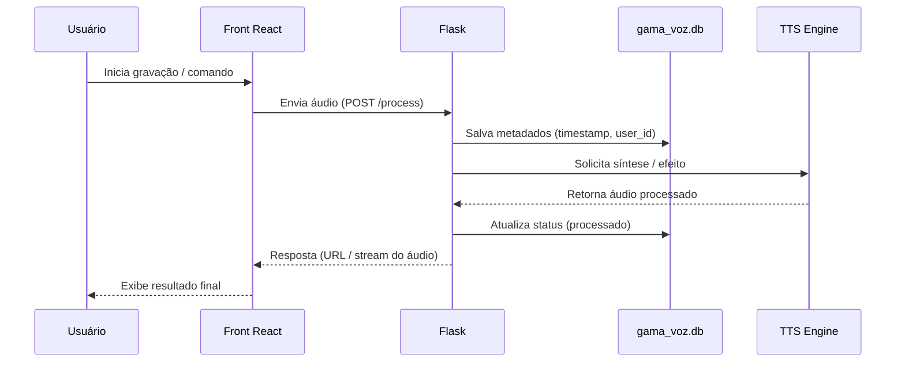

# Fluxo de Dados — GAMA_VOZ

```mermaid
%%{init: {
  "theme": "base",
  "themeVariables": {
    "primaryColor": "#1f2937",
    "primaryTextColor": "#f3f4f6",
    "lineColor": "#6366f1",
    "secondaryColor": "#374151",
    "tertiaryColor": "#111827"
  }
}%%
sequenceDiagram
    participant U as Usuário
    participant FE as Front React
    participant BE as Flask
    participant DB as gama_voz.db
    participant TTS as TTS Engine

    U->>FE: Inicia gravação / comando
    FE->>BE: Envia áudio (POST /process)
    BE->>DB: Salva metadados (timestamp, user_id)
    BE->>TTS: Solicita síntese / efeito
    TTS-->>BE: Retorna áudio processado
    BE->>DB: Atualiza status (processado)
    BE-->>FE: Resposta (URL / stream do áudio)
    FE-->>U: Exibe resultado final
```
