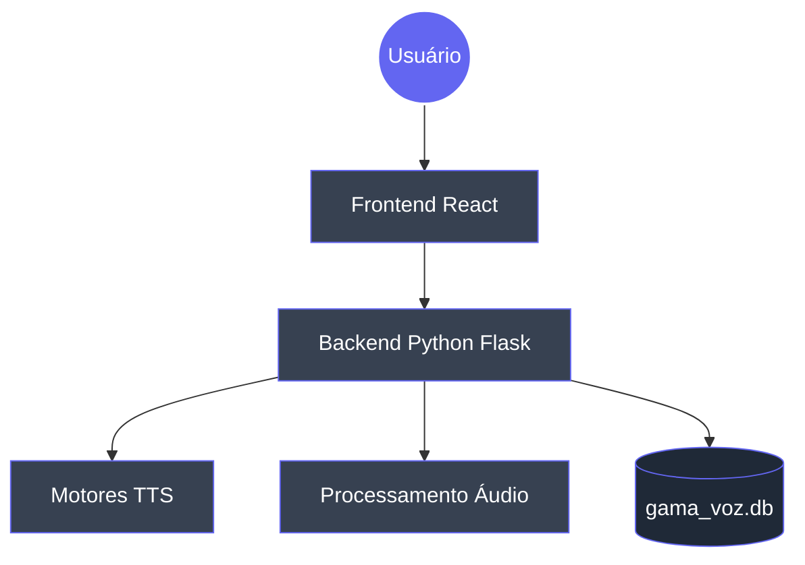

# Macro Arquitetura - GAMA_VOZ

```mermaid
%%{init: {
  'theme': 'base',
  'themeVariables': {
    'primaryColor': '#1f2937',
    'primaryTextColor': '#f3f4f6',
    'lineColor': '#6366f1',
    'secondaryColor': '#374151',
    'tertiaryColor': '#111827'
  }
}%%
graph TD
    classDef main fill:#6366f1,stroke:#fff,stroke-width:2px,color:#fff;
    classDef backend fill:#374151,stroke:#6366f1,stroke-width:1px,color:#fff;
    classDef data fill:#1f2937,stroke:#6366f1,stroke-width:1px,color:#fff;

    User((Usuário)):::main --> FE[Frontend React]:::backend
    FE --> BE[Backend Python Flask]:::backend
    BE --> TTS[Motores TTS]:::backend
    BE --> Audio[Processamento Áudio]:::backend
    BE --> DB[(gama_voz.db)]:::data

    style User fill:#6366f1,color:#fff
```
